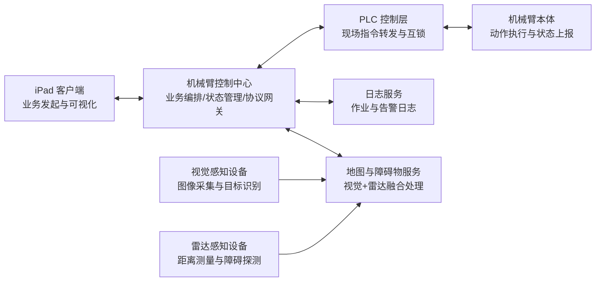
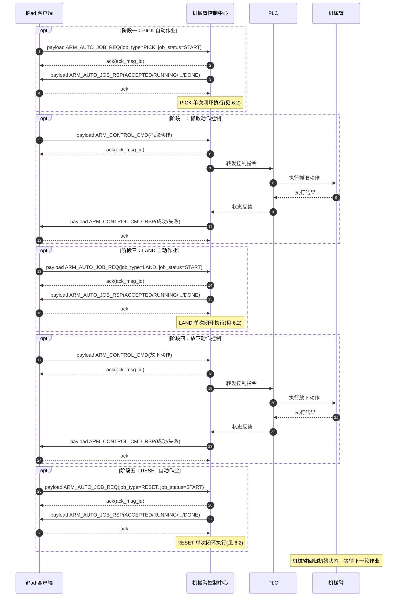
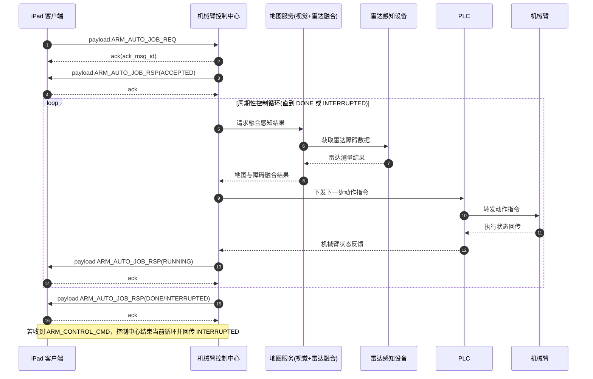
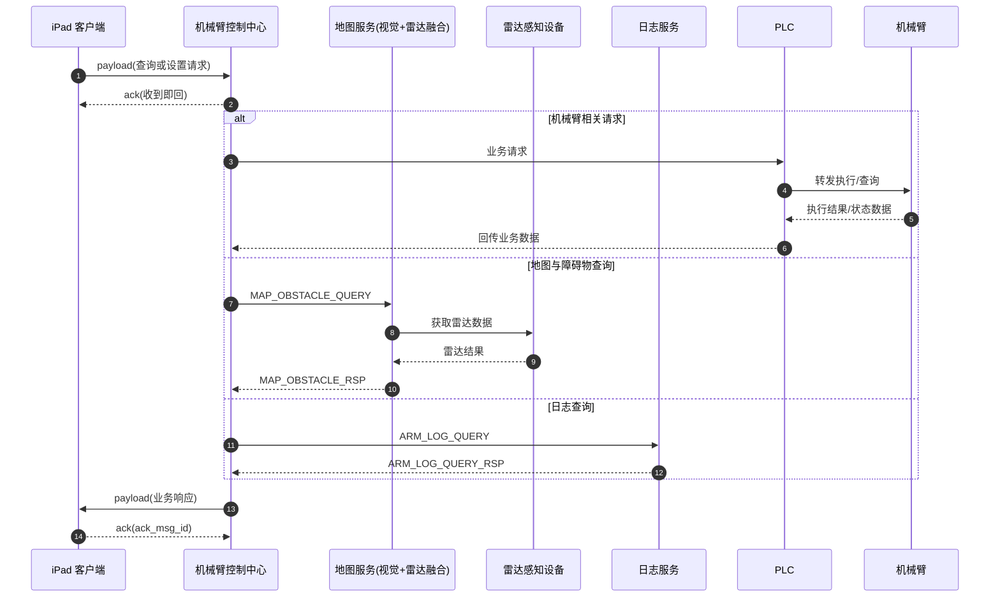

# 高空机械臂视觉自动导航架构设计

- 文档版本：V1.0
- 更新日期：2026-04-12
- 关联文档：通讯协议规范_V1.0、业务消息API_V1.0

## 1. 设计目标

本架构面向高空机械臂自动作业场景，目标如下：

1. 支持 iPad 客户端发起自动作业、状态查询、地图查询、安全设置与日志查询。
2. 实现 iPad -> 机械臂控制中心 -> PLC -> 机械臂 的控制链路闭环。
3. 采用 WebSocket 长连接与统一消息信封，保障多接口一致性和实时性。
4. 控制指令可打断自动作业，并可追踪作业状态从 RUNNING 切换为 INTERRUPTED。

## 2. 总体设计思路

系统由三方核心角色构成：

1. iPad 客户端
- 负责发起业务请求（自动作业、控制指令、查询类请求）。
- 展示作业状态、地图障碍物和日志结果。

2. 机械臂控制中心
- 作为业务中枢与协议网关，负责请求编排、鉴权、路由和状态管理。
- 接收 iPad 自动作业请求后，进入周期性作业控制循环。
- 在每个控制周期内融合视觉与雷达结果，计算下一步动作并下发控制指令。
- 通过 PLC 实时向机械臂发送动作指令，并持续接收执行反馈用于下一周期计算。
- 汇聚 PLC、机械臂、地图服务与日志服务反馈，向 iPad 返回业务响应。

3. 机械臂执行侧（PLC + 机械臂）
- PLC 负责现场控制协议适配与执行转发。
- 机械臂负责动作执行与状态回传。
- 控制中心下发的控制指令通过 PLC 转发到机械臂。

## 3. 逻辑架构

## 4. 通信与消息模型

### 4.1 通信协议

1. 应用层协议：WebSocket。
2. 编码：JSON（UTF-8）。
3. 消息类型：payload、ack、ping、pong。

### 4.2 统一消息信封

所有业务消息遵循统一外层字段顺序：

1. v
2. type
3. api
4. msg_id
5. identity
6. code
7. body
8. ext
9. ts

### 4.3 心跳与连接策略

1. 客户端每 5 秒发送一次 ping。
2. 服务端收到 ping 后返回 pong。
3. 客户端连续 30 秒未收到 pong 判定连接异常。
4. 服务端连续 30 秒未收到 ping 判定连接异常。
5. 异常后触发重连退避：1s -> 2s -> 4s -> 8s -> 16s -> 30s。

## 5. 核心业务流程

### 5.1 自动作业闭环

1. iPad 发起 ARM_AUTO_JOB_REQ (PICK / START) 到控制中心。
2. 控制中心完成 PICK 单次作业闭环（见5.2）。
3. iPad 发起 ARM_CONTROL_CMD 指令，控制转发指令到 PLC，PLC 转发至机械臂完成抓取物料。
4. iPad 发起 ARM_AUTO_JOB_REQ (LAND / START) 到控制中心。
5. 控制中心完成 LAND 单次作业闭环（见5.2）。
6. iPad 发起 ARM_CONTROL_CMD 指令，控制转发指令到 PLC，PLC 转发至机械臂完成放下物料。
7. iPad 发起 ARM_AUTO_JOB_REQ (RESET / START) 到控制中心。
8. 控制中心完成 RESET 单次作业闭环（见5.2）。
9. 机械臂回归初始状态，等待下一轮作业。

### 5.2 单次作业闭环
1. iPad 发起 ARM_AUTO_JOB_REQ (PICK/LAND/RESET、START/STOP) 到控制中心。
2. 控制中心完成校验并初始化自动作业上下文。
3. 控制中心周期性获取地图服务融合结果（视觉+雷达）。
4. 控制中心根据融合结果计算下一步动作。
5. 控制中心将动作指令下发到 PLC，PLC 转发到机械臂执行。
6. 机械臂返回执行状态，PLC 回传控制中心。
7. 控制中心基于最新状态进入下一控制周期，直到作业完成或中断。
8. 控制中心向 iPad 推送 ARM_AUTO_JOB_RSP（ACCEPTED/RUNNING/INTERRUPTED/DONE/FAILED）。

### 5.2 控制打断机制

说明：自动作业过程中AI模块的plc指令优先级高于iPad，为了保障作业安全提供了两类打断控制机制：

#### 5.2.1 急停机制
1. iPad 发起 ARM_CONTROL_CMD 的急停指令
2. 控制中心下发急停指令到 PLC，PLC 转发至机械臂。
3. 机械臂进入受控态并中断自动作业。
4. 控制中心回传 ARM_AUTO_JOB_RSP，job_status 更新为 INTERRUPTED。

#### 5.2.2 停止作业机制
1. iPad 发起 ARM_AUTO_JOB_REQ 停止作业请求。
2. 控制中心下发停止指令到 PLC，PLC 转发至机械臂。
3. 机械臂进入受控态并中断自动作业。
4. 控制中心回传 ARM_AUTO_JOB_RSP，job_status 更新为 DONE。

## 6. 自动作业时序图

### 6.1 自动作业时序图

说明：该时序描述一轮完整自动作业闭环，包含 PICK 抓取、LAND 放下、RESET 复位三个阶段；每个阶段的内部控制循环见 6.2。

### 6.2 单阶段作业时序图

说明：该时序图描述单阶段自动作业闭环，作业阶段包括PICK、LAND、RESET三种作业类型，同时作业状态支持START、STOP两种场景。

## 7. 其他请求响应时序图

说明：该时序适用于机械臂状态查询、地图与障碍物查询、机械臂日志查询、安全设置等通用请求响应场景。

## 8. 接口与模块映射

1. 自动作业
- ARM_AUTO_JOB_REQ、ARM_AUTO_JOB_RSP

2. 状态管理
- ARM_STATUS_QUERY、ARM_STATUS_RSP

3. 控制管理
- ARM_CONTROL_CMD（急停指令会触发自动作业中断）

4. 地图障碍物
- MAP_OBSTACLE_QUERY、MAP_OBSTACLE_RSP

5. 安全与日志
- ARM_SAFETY_CONFIG
- ARM_LOG_QUERY、ARM_LOG_QUERY_RSP

## 9. 可靠性与安全性设计

1. 通信可靠性
- 所有 payload 必须收到 ack。
- msg_id 全局唯一，服务端按 msg_id 去重。

2. 执行安全性
- 常规iPad指定优先级低于自动作业。
- 特殊急停指令优先级高于自动作业。
- 特殊急停指令执行后强制进入中断态，避免并发动作冲突。

3. 可观测性
- 控制中心记录全链路日志：请求、转发、执行结果、响应。
- 日志查询接口支持分页与类型过滤。

## 10. 部署建议

1. 控制中心与 PLC 通道采用专网隔离。
2. 对外链路使用 wss 并启用统一鉴权。
3. 控制中心采用无状态服务 + 状态缓存，支持水平扩展。
4. 关键告警与中断事件接入统一告警平台。
